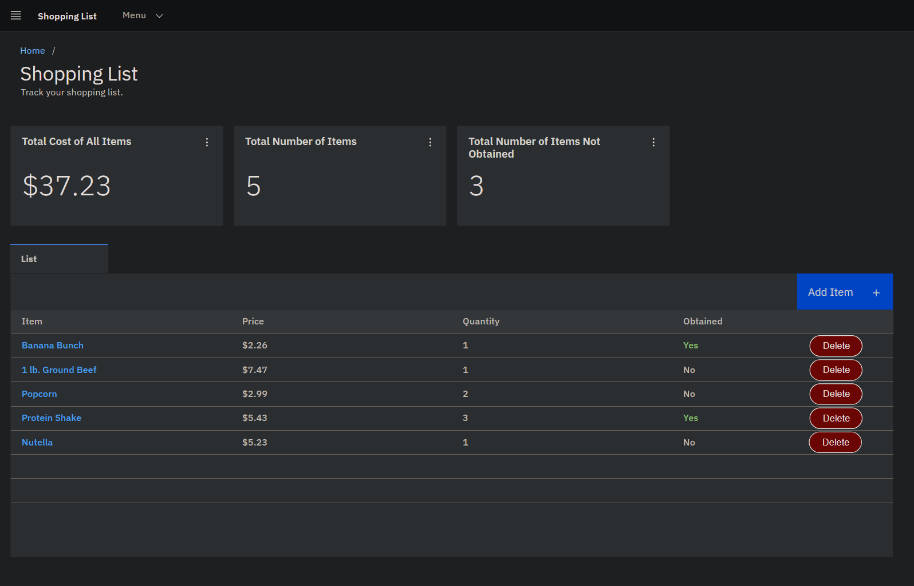

# Shopping List Final Project

Author: Tyler Fernandez

Date: April 9, 2025

## Shopping List Overview

This final project is a minimalistic, gray toned shopping list website. Users will have the ability to add items to their shopping list by inputting essential information, including the item’s name, the quantity they intend to purchase, and a general price for budgeting purposes. 

This project aims to enhance the shopping experience by allowing users to keep track of their items, making adjustments as needed, and ensuring they stay organized while shopping. These items will also be able to given a category, such as "home," "grocery," or "garden." This makes it easier for the user to identify what store to go to, or what part of the store they need to go to. Additionally, users will be able to check off items they have already gotten.
Users will also be able to delete items already on the list, as well as displaying and loading the shopping list in a table. 

The target audience for this project is the general public. It is especially helpful for busy individuals, such as working adults.  Young adults and college students could also benefit from using the site. Furthermore, elderly users who are comfortable with basic web navigation might find the app helpful, especially if I'm able to add features like larger fonts and other accessibility options. Essentially, the website is intended for anyone who regularly shops for goods and wants a digital tool to help their planning. 

This shopping list website will manage item names, category, prices, and quantity. All of these will be dynamically entered by the user through a form that will then be managed through AWS systems.

Another feature I could consider implementing for the shopping list website is the ability to share and link shopping lists with other users. This could enhance the collaborative aspect of the platform, allowing people to work together while planning their shopping trips. Users could simply generate a shareable link or invite others directly through the website, making it easy to collaborate in real time. Additionally, enabling users to leave comments or suggestions on shared lists would foster communication and streamline the shopping experience. This feature would also allow for personalized lists tailored to specific occasions, such as holiday gatherings where multiple people might need to contribute items. Overall, the ability to share shopping lists would not only make the website more interactive but also encourage users to engage with one another and enhance their overall shopping experience.

Another but tougher goal I could consider adding is the ability for users to log in and create their own accounts. This feature would not only enhance user experience but also provide a personalized touch, allowing individuals to have their own space within the application. Moreover, it would enable users to save their preferences and access their shopping lists from any device, enhancing convenience and usability. In addition to this, the capability to create more than one shopping list would be particularly beneficial. Users often have different shopping needs based on occasions, such as weekly groceries, holiday preparations, or special events. By allowing multiple shopping lists, users can easily organize their purchases according to various categories.

## Shopping List Wireframe

